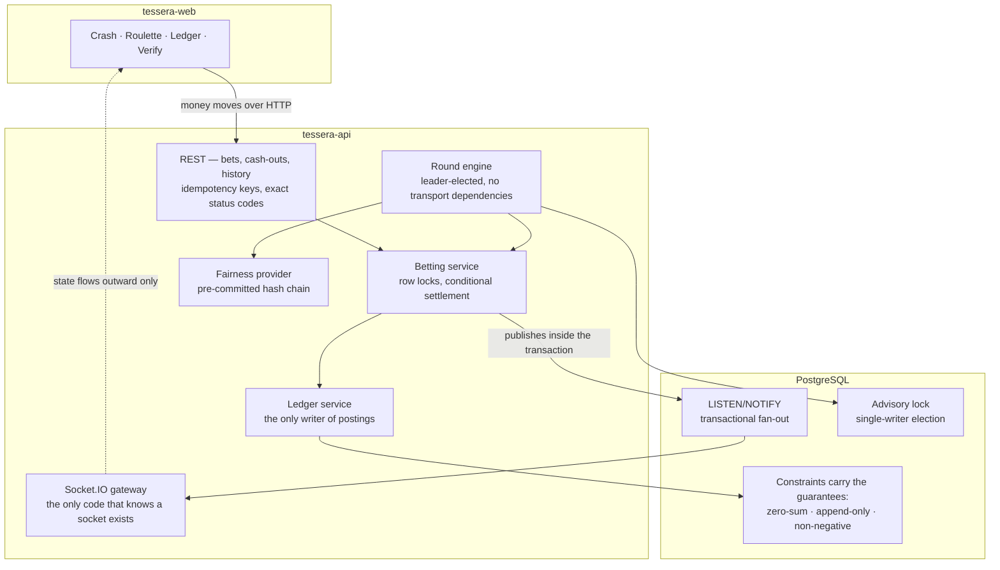

# Tessera — API

**A real-time ledger and settlement engine.**

> Tessera is a **simulated** betting platform. There is no real money in it: no deposits,
> no withdrawals, no cash value, no payment integration of any kind. Balances are virtual
> credits issued by the system itself. It exists to demonstrate ledger integrity,
> concurrency safety, and real-time server-authoritative state — not to be a gambling
> product.

---

## What this is actually about

Three claims, each enforced rather than asserted:

1. **Credits cannot be created or destroyed.** Every balance change is a double-entry
   transaction whose postings sum to zero, checked by a deferred constraint trigger in
   Postgres at commit. A balance is never written directly.
2. **Concurrent bets cannot over-spend an account.** Measured: 200 simultaneous
   bets against an account with funds for 10 — exactly 10 succeed, 190 are refused
   cleanly, zero server errors, and the wallet lands on exactly zero.
3. **Outcomes are fixed before any bet is placed, and anyone can verify it.**
   The crash point is drawn and stored when a round opens and is withheld from every
   API response until it crashes. *(The hash-chain commitment is Phase 4.)*

The interesting part is that these are database guarantees, not application conventions.
If every line of application code were deleted, a raw `psql` session still could not
write an unbalanced transaction, edit a historical posting, or drive a wallet negative.

---

## Status

| Phase | Scope | State |
|---|---|---|
| 0 | Repo, database, CI, health checks | **Done** |
| 1 | Double-entry ledger, auth, invariant tests | **Done** |
| 2 | Round engine, atomic betting, cash-out, load tests | **Done** |
| 3 | WebSocket layer, live UI | **Done** |
| 4 | Hash-chain provable fairness, admin dashboard | **Done** |
| 5 | Docs, demo, deploy | Not started |

136 tests passing, plus HTTP load and latency harnesses.

---

## Running it

Requires Node 22+, pnpm, and a local PostgreSQL 16/17 installation. No Docker.

```bash
pnpm install
cp .env.example .env

pnpm db:up        # starts a dedicated user-owned cluster on 127.0.0.1:5434
pnpm migrate
pnpm start:dev    # http://localhost:3010, API docs at /docs
pnpm test

pnpm seed:demo    # optional: populate players and play 24 rounds
```

`pnpm db:up` runs its own Postgres cluster under `~/.tessera`, separate from any system
Postgres service — so it needs no sudo, touches nothing global, and `pnpm db:reset`
throws it away and rebuilds from scratch. Set `PGBIN` if your Postgres binaries are not
at `/Library/PostgreSQL/17/bin`.

| Script | Does |
|---|---|
| `pnpm db:up` / `db:down` / `db:status` | Cluster lifecycle |
| `pnpm db:psql` | Open a shell on the dev database |
| `pnpm db:reset` | Back up, drop and recreate the database, re-migrate. **Refuses while accounts exist** — `FORCE=1` to override |
| `./scripts/db.sh backup` | Dump the database to `~/.tessera/backups/` |
| `FORCE=1 ./scripts/db.sh destroy` | Remove the whole cluster. Never run automatically |
| `pnpm seed:demo` | Play 24 rounds through the real services so the demo is not empty |
| `pnpm admin:grant <email>` | Promote an account to operator |
| `pnpm typecheck` / `lint` / `test` / `build` | What CI runs |

---

## Architecture



Two things this diagram is making a point of.

**The engine has no arrow to the gateway.** It publishes domain events and has no idea
anything is listening, which is why every concurrency test runs without a socket client
anywhere near it.

**Money moves over HTTP, state flows back over the socket.** Bets and cash-outs need
idempotency keys, precise status codes and safe retries; a dropped socket would leave a
client unable to tell whether its bet landed.

---

## The proof points

Run against a live API with `node loadtest/run.mjs`; the raw artefact is written to
`loadtest/results/latest.json`. Every scenario finishes by asserting the ledger still
balances — "no over-spends" is a weak claim without "and the books reconcile
afterwards", since an implementation could refuse exactly the right number of requests
and still corrupt the ledger doing it.

| Scenario | Result |
|---|---|
| 200 concurrent bets, account funded for 10 | **10 accepted, 190 refused with 409, 0 server errors**, final balance exactly 0 |
| 200 concurrent requests sharing one idempotency key | **1 bet created**, all 200 answered, debited exactly once |
| 100 concurrent cash-outs on one bet | **1 payout**, credited exactly once |
| Ledger after all of the above | global posting sum **0**, drifting accounts **0** |
| Resolve → client broadcast, 50 viewers, 150 broadcasts | p50 **5ms**, p95 **8ms**, max 8ms |

Latency under that load (p50 / p95, milliseconds): over-spend 241 / 260, idempotency
91 / 116, cash-out 104 / 106. These are contention figures, not throughput figures —
every request in the first scenario is queuing for the same wallet row by design.

### What the row lock actually buys

Worth stating precisely, because it is easy to over-claim. `SELECT ... FOR UPDATE` on
the wallet is **not** the only thing preventing an over-spend — the non-negative balance
trigger is the real last line of defence, and the final balance is correct with or
without the lock. What the lock changes is the failure mode. Measured at 40 concurrent
bets against an account with funds for 10:

| | succeed | refused cleanly | constraint violations |
|---|---|---|---|
| with `FOR UPDATE` | 10 | 30 | **0** |
| without | 10 | 2 | **28** |

Those 28 read a stale balance, did the work, and were caught by the database at the last
moment — reaching the client as a 500 rather than a 409. Defence in depth, with each
layer doing a different job. There is a test that fails if the lock is removed.

Two bugs surfaced from trying to make that test fail rather than pass:

- Bet placement locked the **round** row `FOR UPDATE`, which serialised every bet on a
  round and meant nothing ever reached the wallet lock concurrently — the guarantee was
  untested and the throughput ceiling was one bet at a time. It is `FOR SHARE` now: bets
  run in parallel and still block the engine's exclusive lock when betting closes.
- A one-bet-per-user-per-round unique index made the headline scenario meaningless,
  since N simultaneous bets would collapse to one success because of the index rather
  than the balance check.

---

## The ledger

Four account kinds. Every credit in existence traces back to `MINT`.

| Account | Role |
|---|---|
| `SYSTEM:MINT` | The sole source of credits. Signup grants debit it, so its balance is the negative of everything ever issued. |
| `USER:<id>:WALLET` | A player's spendable balance. |
| `SYSTEM:ESCROW` | Holds stakes for the duration of a round. |
| `SYSTEM:HOUSE` | Absorbs losses, funds winnings. |

```
signup grant        MINT   −1000  →  WALLET +1000
place bet           WALLET −stake →  ESCROW +stake
cash out at m       ESCROW −stake →  WALLET +stake
                    HOUSE  −stake*(m−1) → WALLET +stake*(m−1)
crash, no cash-out  ESCROW −stake →  HOUSE  +stake
```

**Amounts are integer minor units.** 100 units = 1 credit. No floats touch a balance, and
the `Money` type is branded so a bare `number` will not compile where an amount is
expected. Multipliers are basis points (`10_000` = 1.00x). Payouts floor, always in the
house's favour, so repeated payouts cannot leak fractions upward.

### The guarantees, and where they live

All three are in [`migrations/1757900000000_initial-ledger.sql`](migrations/1757900000000_initial-ledger.sql):

- **Transactions must balance** — a deferred constraint trigger rejects, at commit, any
  transaction whose postings do not sum to zero or that has fewer than two legs.
  Deferred so a service can insert the debit and credit legs as separate statements.
- **The ledger is append-only** — `UPDATE` and `DELETE` on `entries` and `transactions`
  raise. Implemented as a trigger rather than a `REVOKE` so the guarantee travels with
  the schema into CI and tests with no role setup to forget.
- **Wallets and escrow cannot go negative** — the last line of defence against an
  over-spend, independent of any application check. `MINT` and `HOUSE` are exempt:
  `MINT` is negative by construction, and `HOUSE` is legitimately negative when players
  are up.

`GET /health/ledger` is a Terminus health indicator reporting the global posting sum and
any account whose cached balance has drifted from the sum of its postings. It is asserted
at the end of every CI run, and will be asserted at the end of every Phase 2 load test.

### A subtlety worth recording

The first implementation updated balances with `INSERT ... ON CONFLICT DO UPDATE`. That
is quietly incompatible with a `BEFORE INSERT` non-negative trigger: Postgres fires the
insert trigger against the *proposed* row before it detects the conflict, so a posting of
`−1` tripped the guard even though the resolved balance would have been `0`. Every
account now gets its balances row by trigger at creation, which makes posting a plain
`UPDATE` — no upsert, no interaction, and it takes the row lock we want anyway.

---

## The games

Two tables run concurrently, sharing one engine, one ledger, one fairness chain and one
real-time layer. They are deliberately opposite in the way that matters: crash's difficulty
is timing, roulette's is combinatorial settlement.

| | Crash | European roulette |
|---|---|---|
| Bets per round | One implicit | Many, at different odds |
| Player decision | When to cash out, under time pressure | What to back, before the spin |
| Settlement | Races the resolver | Every bet evaluated against one pocket |
| House edge | ~1.4%, measured over 200k rounds | Exactly 2.70%, the single zero |

The lifecycle is shared and named game-neutrally — `OPEN → LOCKED → RUNNING → RESOLVED →
SETTLED`, with `VOIDED` for a round the engine failed to resolve. A roulette round sitting
in status `FLYING` and then `CRASHED` would have been nonsense, so the states describe the
shape rather than one game's vocabulary. Likewise a winning bet is `WON`, not `CASHED_OUT`:
cashing out is a crash action, and a roulette bet has no such moment.

### European roulette

37 pockets, single zero. Straight-up, red/black, odd/even, low/high, dozens and columns.

Every bet on the table pays true odds against 36 pockets while the wheel has 37, so **every
bet type carries exactly the same 2.70% edge** — there is no better or worse value on the
board, which players routinely assume otherwise. Measured over 200,000 spins derived from
real hashes, every bet type returns 97.3% of stake.

Zero is handled by omission rather than special case: it is in no colour, no parity, no
dozen and no column, so every outside bet loses on it naturally and only a straight-up bet
on 0 wins. The rules live in `@tessera/contracts`, so a client prices a bet and predicts a
settlement without asking the server.

Odds are stored **on the bet** at placement, not looked up at settlement, so editing the
odds table can never retroactively change what an already-placed bet pays. There is a test
for that.

### Crash

One crash round at a time, driven by a leader-elected engine:

```
 OPEN ──20s──▶ LOCKED ──▶ FLYING ──▶ CRASHED ──▶ SETTLED ──▶ (next round)
  │                          │
  │ place a bet              │ cash out
  └── allowed                └── allowed
```

The multiplier climbs on a fixed curve — 2.01x at 7s, 4.45x at 15s, 19.79x at 30s,
capped at 997.78x. The curve lives in `@tessera/contracts` and is **integer-only**:
`Math.exp` and `Math.pow` are not guaranteed bit-identical across JavaScript engines, and
a client whose curve disagreed by a rounding step would show a player a number the server
will not pay. The closed form is exact BigInt arithmetic with a single floor, so every
engine agrees by construction.

**The client never sends a multiplier.** `POST /rounds/bets/:id/cashout` takes an
idempotency key and nothing else. The server derives the multiplier from the database
clock and the round's own `started_at`, and compares it against the crash point
*directly* rather than trusting `rounds.status` — if the engine has not yet ticked the
round to CRASHED, the row still says FLYING, and paying out on that basis would pay for a
multiplier that never existed. There is a test for exactly that case.

The engine holds a Postgres advisory lock, so only one process advances rounds. Two
replicas each running a scheduler would open duplicate rounds and settle bets twice — a
bug that never appears in single-instance development. It is also a correctness property
of the engine, decided independently of how any deployment happens to run it; a partial
unique index refuses a second live round regardless.

The engine has **no transport dependencies** — it does not import a gateway or know what
a WebSocket is. Phase 3 subscribes to it rather than changing it.

### When the engine stops

A round found more than five seconds past its crash point means nothing was resolving it
— a healthy engine does so within one 100ms tick. Resolving it normally at that point
would mark every still-active bet as lost, charging players for a round they had no
opportunity to cash out of. So the round is **voided** instead and every stake refunded
straight out of escrow; the house neither wins nor loses, because no outcome was used.
Players who cashed out before the outage keep their winnings.

The seed is revealed on a void as well. Voiding is the only power the operator has to
make a round not count, so an operator able to void silently could dodge expensive
payouts by voiding whenever the drawn outcome was costly. Revealing makes every void
auditable against the outcome it discarded.

### Live state

A Socket.IO gateway on `/live` is the only place in the codebase that knows a WebSocket
exists. The engine and the betting service publish domain events with no knowledge of it,
which is why all of Phase 2 is tested without a socket client anywhere near it.

**Fan-out is over Postgres `LISTEN`/`NOTIFY`, not Redis.** The engine runs on one leader,
but every instance has clients connected to it, so local events are not enough — a
follower would broadcast nothing. Using the database already in the stack means one fewer
service to run, deploy, secure and explain, which is the PRD's own warning about adding
infrastructure for its own sake.

The property that makes it more than a shortcut: `pg_notify` is **transactional**. A
notification queued inside a transaction is delivered only if that transaction commits, so
publishing an event alongside the write it describes is atomic. No client is ever told
about a bet that rolled back — no outbox table, no reconciliation. What it is not is
durable, which is why every reconnect resyncs against full round state rather than
replaying a backlog.

**Clients compute the climbing multiplier themselves** from the round's `startedAt`. The
server broadcasts lifecycle transitions plus one low-frequency sync every two seconds.
Pushing the number at 60fps to every viewer is the obvious implementation and the wrong
one: it is O(viewers × framerate) messages for information the client already has what it
needs to derive. Every payload carries `serverTime`, and a `ping` round-trip lets a client
correct for a skewed local clock — otherwise a machine thirty seconds fast renders a
wildly wrong multiplier and looks identical to a slow connection.

Watching is public; a visitor sees the game without an account. A token only adds the
personal room, where balance and settlement events go. **Nothing that moves money travels
over the socket** — bets and cash-outs stay on HTTP, because they need idempotency keys,
precise status codes and retry semantics, and a dropped socket leaves a client unable to
tell whether its bet landed.

## Provable fairness

The claim is that an outcome could not have been chosen to suit the bets — and it is
checkable by anyone, without trusting this server.

### How it works, in plain terms

Before the very first round runs, the server picks a secret at random and hashes it
thousands of times, building a chain backwards:

```
  s[10000] = random secret
  s[9999]  = sha256(s[10000])
  s[9998]  = sha256(s[9999])
  ...
  s[0]     = sha256(s[1])        <- published before anyone can bet
```

`s[0]` is published first. Round 1 uses `s[1]`, round 2 uses `s[2]`, and each seed is
revealed once its round ends.

The reason this proves anything: **sha256 cannot be run backwards.** Hashing a revealed
seed forward lands you on the genesis published before a single bet existed. To fake a
round, the server would have to find a different seed that still hashes to the same
commitment — which is the thing sha256 is designed to make infeasible. The entire
sequence of outcomes was fixed before the first player arrived.

Every round links to a verification page that recomputes all three checks in your
browser with Web Crypto: the seed matches the commitment, the outcome follows from the
seed, and the seed hashes back to the genesis. The server is asked for the proof once and
then not consulted again — asking it whether it was honest would prove nothing.

### Why a chain rather than commit-and-reveal

Publishing a hash before each round and revealing it after is the common approach, and it
is weaker. It proves the server did not change its mind *after* seeing the bets. It does
not prove the server did not draw a hundred seeds beforehand and publish whichever one it
liked. A chain closes that, because every seed is determined by the one after it, all the
way back to a commitment made before the first round.

Chains are finite. An exhausted one is succeeded by another whose genesis is committed
before its first round, and every commitment is listed at `/rounds/fairness/chains` —
because silently rolling into a fresh chain would hand the operator back exactly the
freedom the chain removes.

### The house edge, stated

| Game | Edge | Where it comes from |
|---|---|---|
| Crash | ~1.4% | A 1-in-101 instant bust, plus the draw's own mass at 1.00x and two-decimal truncation |
| Roulette | 2.70% | The single zero, and nothing else |

Both measured over 200,000 outcomes derived from real hashes, not asserted from theory.
A crash player cashing out at any fixed multiplier returns ~98.6% of stake; every roulette
bet type returns 97.3%. Published as constants, because a hidden edge is precisely what
provable fairness exists to rule out.

---

## Auth

Email + password (argon2id, OWASP baseline parameters), access JWT plus refresh token
with **rotation and reuse detection**. Every login starts a token family; each refresh
rotates and marks the old token spent. Presenting a spent token means theft-and-replay or
a client racing itself, and both get the same answer: revoke the whole family.

The revocation commits before the error is raised. That ordering is the entire point — an
earlier version revoked inside the transaction and then threw, which rolled the revocation
back and left the compromised family live while the logs claimed otherwise.

Refresh tokens are stored as a SHA-256 digest, never in the clear. Plain SHA-256 rather
than argon2 is correct *here* specifically: the token is 128 bits of server-generated
randomness, so there is no dictionary to attack and a slow hash would only add latency to
every refresh.

Login timing is constant whether or not the email exists — an unknown address is verified
against a precomputed dummy hash, so response time does not enumerate the user table.

### The KYC seam

There is no KYC, because there is no real money. But `AccountStatusGuard` sits on the path
a bet will take and reads a `users.status` column that already has a
`pending_verification` state. A real identity check has a decided, wired, tested place to
live. The bet path would not change.

---

## Endpoints

| Method | Path | Notes |
|---|---|---|
| `POST` | `/auth/register` | Creates user, wallet and opening grant in one transaction |
| `POST` | `/auth/login` | |
| `POST` | `/auth/refresh` | Rotates; detects reuse |
| `POST` | `/auth/logout` | Revokes the token family |
| `GET` | `/me/balance` | Derived from the ledger |
| `GET` | `/me/ledger` | Keyset-paginated posting history |
| `GET` | `/rounds/current` | The round accepting bets or in flight |
| `GET` | `/rounds/:id` | One round, with its reveal once crashed |
| `GET` | `/rounds/:id/bets` | Your bets on that round |
| `POST` | `/rounds/:id/bets` | Place a bet (stake + idempotency key) |
| `POST` | `/rounds/bets/:betId/cashout` | Cash out — **no multiplier accepted** |
| `GET` | `/me` | The authenticated account |
| `GET` | `/health` · `/health/ready` · `/health/ledger` | Liveness, readiness, integrity |

Authentication is on by default — routes opt out with `@Public()`, so a new endpoint
cannot be left unprotected by forgetting a decorator.

---

## Layout

Conventional NestJS: feature modules at `src/` root, cross-cutting concerns in `common/`.

```
migrations/            Hand-written SQL. Owns every constraint and trigger.
scripts/db.sh          Local cluster lifecycle.
packages/contracts/    Shared with tessera-web over a git dependency.
src/
  common/
    decorators/        @Public, @Roles, @CurrentUser
    filters/           Domain error -> HTTP mapping
    guards/            Rate limiting
    types/             Authenticated request shape
    value-objects/     Money, BasisPoints
  config/              Env schema — the process refuses to boot on bad config
  database/            Kysely wiring, schema types, BIGINT parsing
  ledger/              The only code permitted to write postings
  auth/                Registration, login, rotation, guards
  users/               Users table, balance, history
  health/              Terminus checks incl. the ledger invariant
test/                  e2e and property-based tests against real Postgres
```

Tests run against real Postgres, never a mock, because every guarantee here is enforced by
Postgres. A mocked database would be testing the mock.

---

## The shared contract

`packages/contracts` is the single definition of everything both repos must agree on:
wire types, and the arithmetic. `formatMinorUnits` and `applyBasisPoints` live there, so
the payout the client displays and the payout the server settles are the *same function*
rather than two implementations that happen to agree today.

The API consumes it through a pnpm workspace. `tessera-web` installs it from git — no
registry, no publish step:

```bash
pnpm add "github:Favalcodes/tessera-api#path:/packages/contracts"
```

The package is deliberately dependency-free and framework-free. pnpm runs its `prepare`
script on the consumer's machine, so anything it needs to build, the consumer pays for;
and it has to compile unchanged in both a browser and Node, because it does both.

Phase 2's multiplier curve and Phase 4's fairness verifier belong here for the same
reason: the client interpolates the climbing multiplier locally from a broadcast
timestamp, and a curve that differs from the server's by a rounding step would show a
player a number the server will not pay.

---

## Decisions

**Why a crash-style game.** It is the only candidate with two concurrency-critical write
paths rather than one. Bet placement is the path every such project shows; cash-out is the
harder one, because it races the round resolver — a double cash-out or a cash-out landing
after the crash is a real correctness bug a naive implementation will have.

**Why own the WebSocket layer.** "A managed service pushed it to the client" is a thin
answer. Fanning out from a single authoritative round engine, having clients interpolate
the multiplier locally from a broadcast timestamp, and resyncing reconnects against round
state rather than replaying missed ticks — that is the part worth being able to explain.

**Why full double-entry rather than signed single-entry.** A `type` column with a sign
lets credits be created from nothing with nothing to detect it. Real double-entry gives a
global invariant — every posting in the system sums to zero — checkable in one query.

**Why the server derives the multiplier.** A client-supplied multiplier is a request to be
paid an arbitrary amount. Deriving it from the server's own clock also means a lagging
client cannot be paid for a cash-out that arrived after the crash.

**Why Kysely and hand-written SQL rather than Prisma.** The constraints above are the
product. Prisma's schema language cannot express a deferred constraint trigger, an
append-only guard, or a conditional non-negative check, so they would have been unmanaged
raw SQL regardless. Kysely keeps full type safety while `SELECT ... FOR UPDATE` and
advisory locks — both load-bearing in Phase 2 — stay first-class and visible.

---

## What I would do differently at real-money scale

The point of this section is that the build stops somewhere deliberate, and I know where.

**Tokens would leave localStorage.** A refresh token reachable from JavaScript is
reachable by any XSS. Real money means an httpOnly, `SameSite=Strict` cookie set by the
API, with the access token held only in memory. That change also lets the dashboard render
server-side and removes the one lint exemption in the web app.

**The balances cache would stop being a cache I maintain by hand.** Today
`LedgerService.post` updates it in the same transaction as the postings. That is correct,
but it is a second place that can be wrong. At scale I would make it a materialised view
refreshed transactionally, or drop it entirely and read `sum(amount)` against a covering
index — and measure before choosing, rather than assume the cache is faster.

**Settlement would move out of the request path.** A round with fifty thousand bets
settles in one transaction here, which holds locks for as long as that takes. It would
become a batched, resumable job keyed by round, so a crash mid-settlement resumes rather
than rolls back the lot.

**The engine's single-writer lock would need a story for lock loss.** A Postgres advisory
lock is released if the connection dies, which is what makes it safe — but a leader that
is merely *slow* still holds it. I would add a heartbeat the leader must keep writing, and
have it stand down if it cannot.

**`pg_notify` would probably not survive.** It is transactional, which is genuinely
valuable, and it is not durable. At volume I would keep the transactional publish but write
to an outbox table and have a relay drain it, so a client that was disconnected for a
second does not silently miss a settlement.

**Idempotency keys would get a TTL and a stored response.** Today a replay re-reads the
bet. That is correct but only because a bet is cheap to look up; a general idempotency
layer stores the original response body and expires it.

**KYC, AML and responsible-gambling controls would exist at all.** `AccountStatusGuard` is
a seam, not an implementation. Real money means identity verification, sanctions screening,
deposit limits, self-exclusion, and jurisdiction-by-jurisdiction rules about what may be
offered to whom. That is not a feature I have stubbed — it is a body of work larger than
everything here.

**Money would stop being a JavaScript number.** Integer minor units in a `BIGINT` are
exact well past any plausible balance, and the `Money` type refuses anything unsafe. But a
system handling many currencies wants an explicit currency on every posting and a decimal
type that cannot be coerced to a float by accident.

**The load tests would run continuously, not on demand.** The numbers quoted above are
from a run on a laptop. They belong in CI on a fixed machine, tracked over time, so a
regression in the concurrency path shows up as a graph rather than a surprise.

---

## Licence

MIT.
